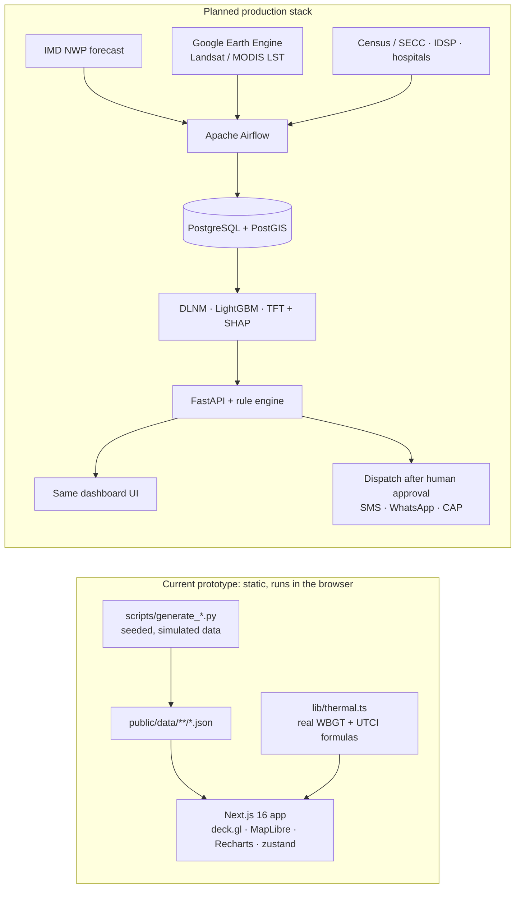

# UshnaRaksha — Heat-Health Early Warning

**Ward-level heat-stress (WBGT/UTCI) risk, a 3–5 day forecast and human-approved alerts, so cities can act before a heatwave kills.**

SIH 2026 · Problem Statement SIH26083 · Team "Good Team" · [MIT licensed](LICENSE)

> **All data in this prototype is simulated.** Forecasts, health numbers, model metrics and impact estimates come from seeded scripts so the demo tells a consistent story. The one real computation is the [heat-stress calculator](#heat-stress-calculator). See [Built vs planned](#built-vs-planned).

## Screenshots

| | |
|---|---|
|  |  |
|  |  |
|  |  |
|  |  |
|  |  |

(Screenshots to be added; see [docs/screenshots/README.md](docs/screenshots/README.md).)

## Features by tab

| Tab | Key | What it shows |
|---|---|---|
| **Early Warning** | `1` | Ward risk map over 256 zones (~120 m): WBGT tiers, UTCI, vulnerability or satellite LST; 2D/3D; cooling centres and hospitals with daily load; 6-day forecast timeline you can play; city outlook with a 6-day chart and resources; ward detail with WBGT/UTCI forecast, predicted admissions and deaths, SHAP "why flagged", who is at risk and actions. |
| **Alerts** | `2` | Alert queue; SMS, WhatsApp (English and Hindi) and CAP XML previews; human "Approve & dispatch" flow with delivery counters; history and settings. |
| **Impact** | `3` | Lives saved and admissions avoided with a 3-day warning vs none or a 1-day warning, a lead-time slider, per-day and per-ward breakdowns, assumptions and an Ahmedabad benchmark. |
| **Model Insights** | `4` | Pipeline, DLNM exposure- and lag-response, TFT backtest and skill by lead day, baseline comparison, heat and mortality history. |
| **Urban Planning** | `5` | The original 3D heat-attribution tool: real OSM footprints, per-building attribution, cooling interventions with cost. |
| **How it works** | `6` | Formulas, IMD tiers and the local-95th-percentile rule, data sources, model cards, the decision flow, what is real vs simulated, and references. |

Also: a **heat-stress calculator** (header or `C`), a **title screen** for the demo video (`I` or `?intro=1`), and a **mobile fallback** screen under 1024 px wide (the dashboard needs a desktop). On the Early Warning tab: `←`/`→` change the day, `Space` plays, `D` toggles 3D, `Esc` closes panels.

### Heat-stress calculator

`lib/thermal.ts` computes, live in the browser, the Stull (2011) wet-bulb temperature, a WBGT estimate (`0.7·Tw + 0.3·Ta + radiant`, the same formula the data generator uses) and the UTCI via the 6th-order polynomial of Bröde et al. (2012), ported from [pythermalcomfort](https://github.com/CenterForTheBuiltEnvironment/pythermalcomfort) (MIT; see [THIRD_PARTY_NOTICES.md](THIRD_PARTY_NOTICES.md)). It is tested against that package's reference values:

```bash
npm run test:thermal
```

## Architecture



## Built vs planned

| Capability | Status |
|---|---|
| Dashboard UI (6 tabs, map, charts, alerts flow) | **Built** (static prototype) |
| WBGT and UTCI calculator | **Built**, real formulas, tested |
| Ward-level forecast, health impact, model metrics, impact scenarios | **Simulated** by seeded scripts |
| Satellite LST, census vulnerability | **Simulated** (formula-generated) |
| Building footprints (Urban Planning) | **Real** OSM data, simulated attributes |
| Live IMD / satellite / census / hospital ingestion | Planned |
| DLNM, LightGBM, TFT training and serving | Planned |
| FastAPI, PostGIS, Airflow | Planned |
| Real SMS / WhatsApp / CAP dispatch | Planned |

## Run it

```bash
npm install
npm run dev      # http://localhost:3000
npm run build && npm run start
npm run test:thermal
```

`dev` and `build` use `--webpack` on purpose (MapLibre's worker setup does not work with Turbopack).

## Regenerate the data

```bash
python3 scripts/generate_risk_data.py   # wards, cells, alerts, models   (needs public/data/grid.geojson)
python3 scripts/generate_ops_data.py    # facilities.json and impact.json (run after the first one)
```

Both use only the standard library, are seeded (same output every time) and need no network. They write `public/data/risk/*.json`.
**Do not re-run `scripts/generate_data.py`**: it downloads building footprints from OpenStreetMap and would change the Urban Planning data.

## Deploy on Vercel

1. In Vercel: **Add New → Project → Import Git Repository**, pick this repo.
2. Set the production branch (Settings → Git), or deploy the branch as a preview.
3. Framework preset **Next.js**. Build command **`npm run build`** (do not override it with plain `next build`: the script adds `--webpack`). Defaults for install and output; root directory is the repo root.
4. No environment variables. Node 20.9 or newer.
5. `public/` is served statically (`/maplibre-worker.mjs`, `/maplibre-gl-shared.mjs`, `/data/**`). Map tiles come from Esri; fonts are fetched from Google Fonts at build time.

## Repo layout

```
app/                Next.js app router entry (one page)
components/         warning/ alerts/ impact/ models/ how/ planning/ shell/ charts/
lib/                store, data loading, types, thermal.ts (calculator maths), risk helpers
scripts/            data generators and the thermal test
public/data/        static JSON (risk/ is generated)
docs/               design spec and notes
```

## License

[MIT](LICENSE) © 2026 Good Team. Third-party notices: [THIRD_PARTY_NOTICES.md](THIRD_PARTY_NOTICES.md).
